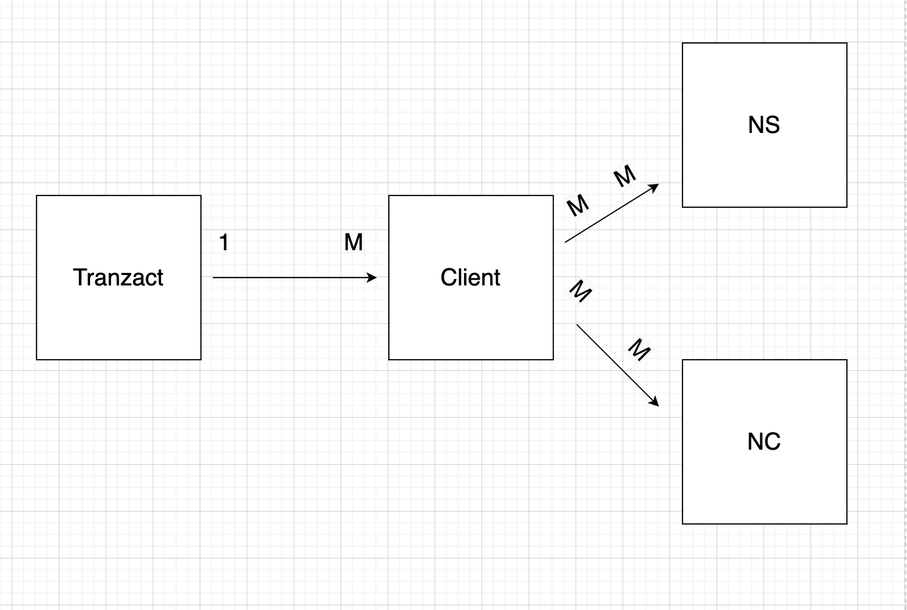
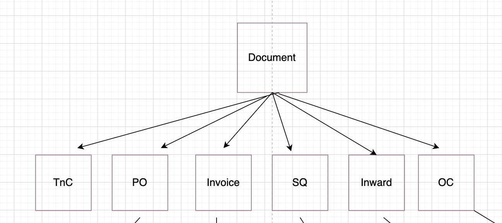
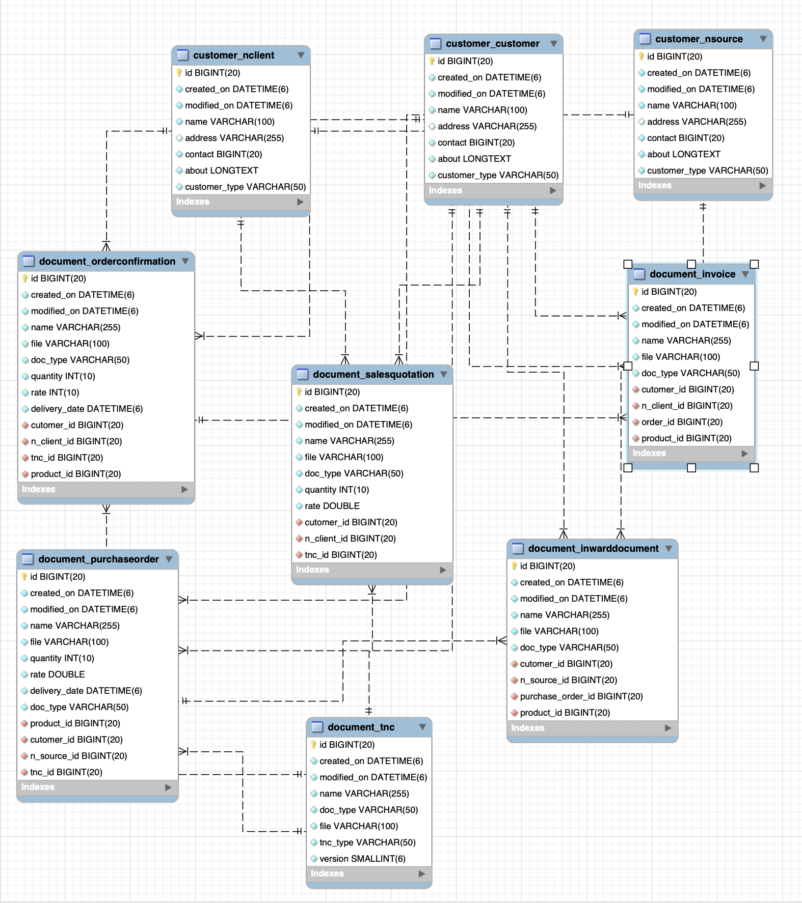
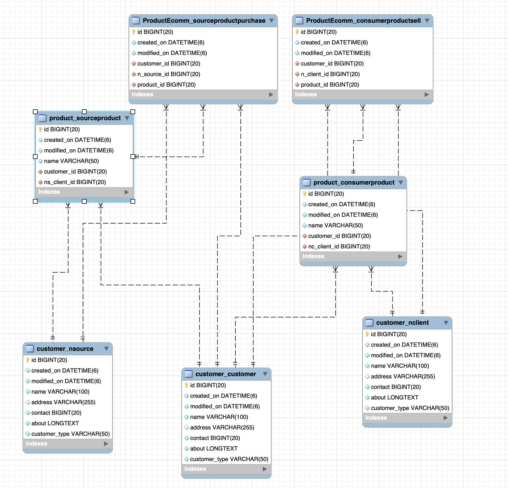
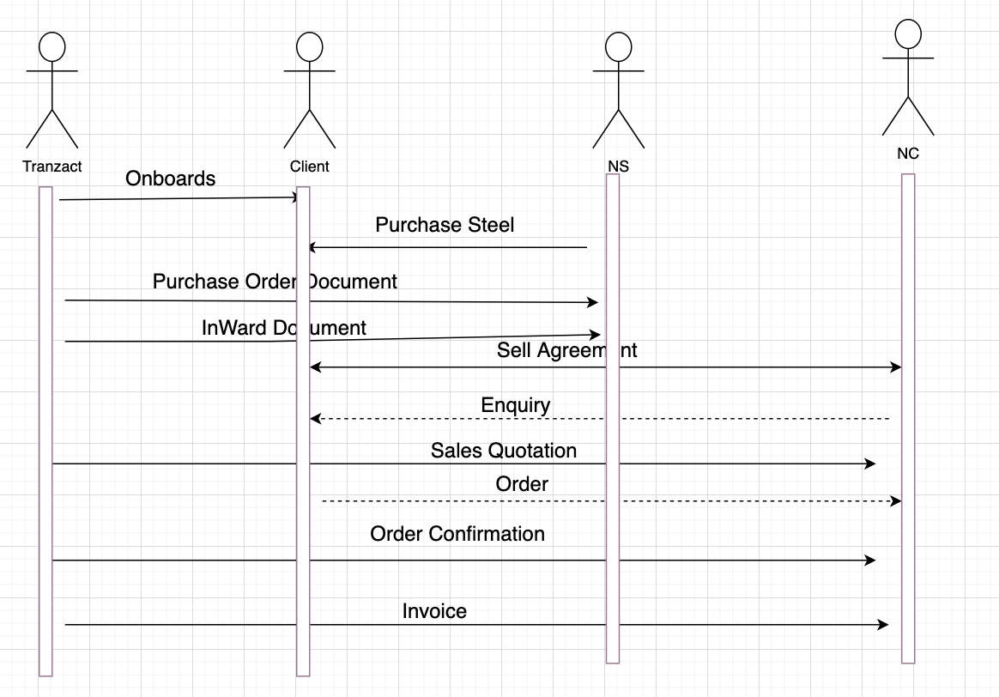
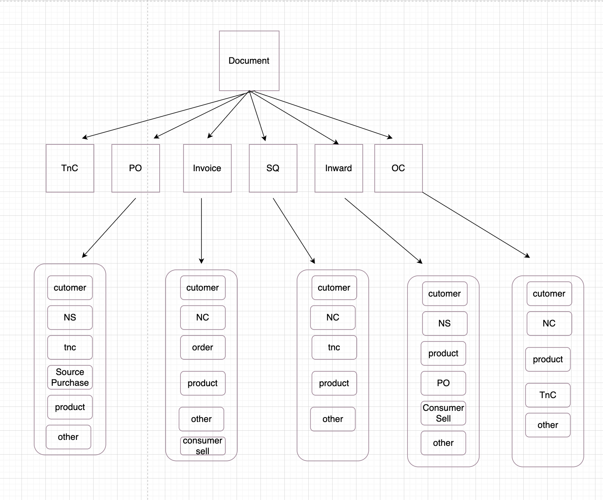
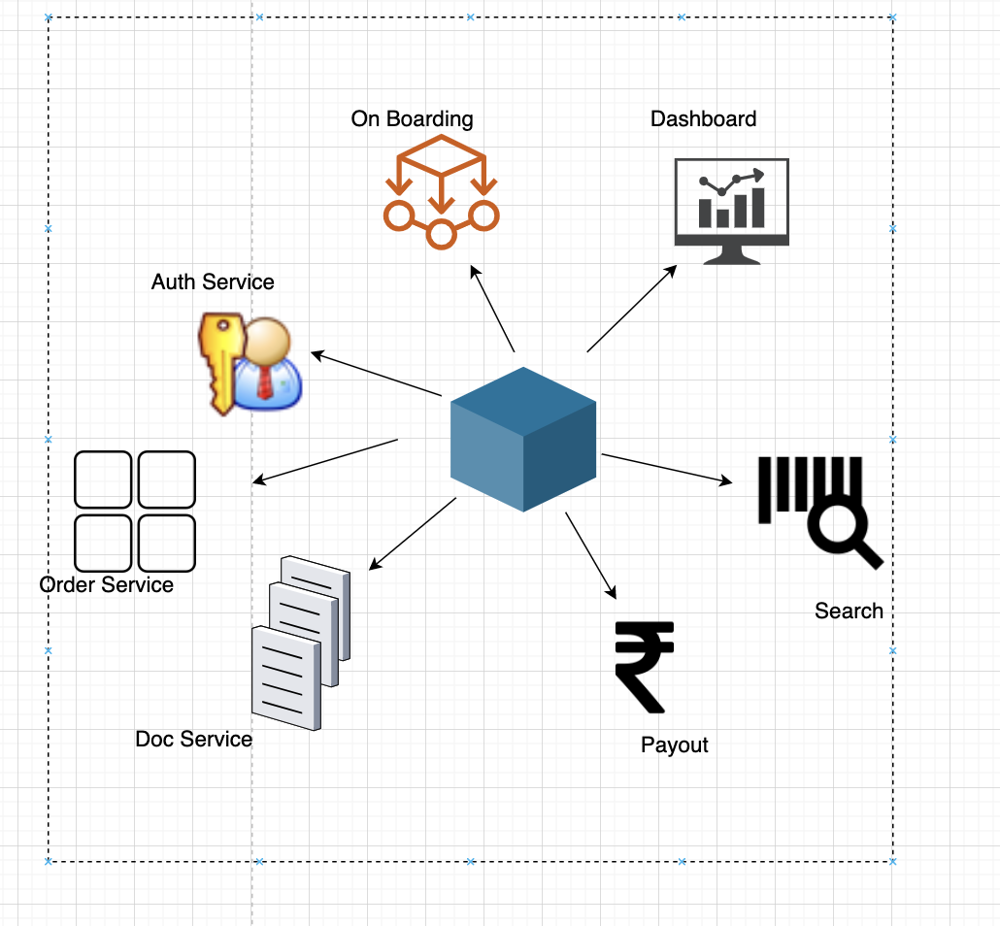
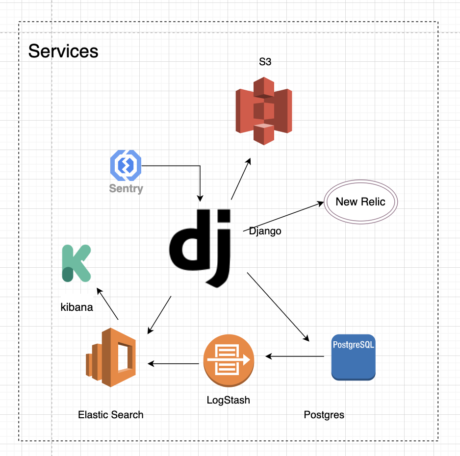

# Tranzact

  B2B SaaS platform used by SME manufacturing companies to streamline their transaction. A market place layer is built on top of the SaaS platform.
	
## Context	
  TranZact is used by companies to create/maintain a lot of transactional documents.The details of the current database struture are given in the sheet named Database Data.The current database is a mysql relational db.
	
## Entities	
  ### TZC
    A TranZact client who pays us a monthly SaaS fees for using TranZact platform. They manufacture springs
  ### NC
    A customer of TZC who purchases spring from TZC
  ### NS
    A supplier of TZC who sells raw material - steel to TZC
  
  
    
	
## Documents
  ### Purchase Order (PO)
    A document which is sent by TZC to NS when they have to purchase steel. It contains information such as quantity, rate, delivery date, terms and conditions etc
  ### Order Confirmation (OC)
   A document which is sent by TZC to NC when they agree to sell spring to NC. It contains information such as quantity, rate, delivery date, terms and     conditions etc
  ### Invoice
    When TZC supplies material to NC, TZC creates an Invoice for NC
  ### Sales Quotation (SQ)
    A document which is sent by TZC to NC when NC enquires about Rate, Quantity etc for buying spring from TZC. This is just a information document about the details. Once the order is confirmed by NC, Order Confirmation is placed by TZC to NC.
  ### Inward Document
    A document which is sent by TZC to NS when the goods sent by NS have been received by TZC.It contains the receipt dates.

   

  
## Sell Purchase
  TZC purchase Steel from NS and sells Spring to NC.
  1: Many TZC can buy source material from many NS
  2: Many TZC can sell consumer product to many NC.
  3: It' a many to many model described as ProductEcomm model, which is a many-to-many model of Entities and Product

  

## Simple Flow Diagram of Process
  
  

## Model Entity Relationship Overviews
  

## Micro Services
  We can break the requirement into multiple micro services.
  Each Service will take care of 
    

## Technology
      

